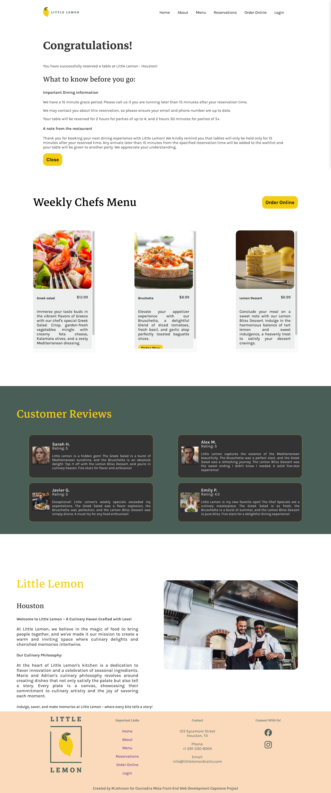

# Little Lemon Capstone Project
## Description:
This is Mahoghani Johnson's capstone project created for the Meta Front-End Web Developer Course on Coursera
Figma wireframe & prototype: https://www.figma.com/file/BNGxoD1fnWHT7ixOfnQKIz/Little-Lemon-Wireframe?type=design&node-id=1%3A611&mode=design&t=UWJNxG1v3r5RFMCg-1

## Screenshots:
### Home Page

### Booking Page

### Confirmation Page

